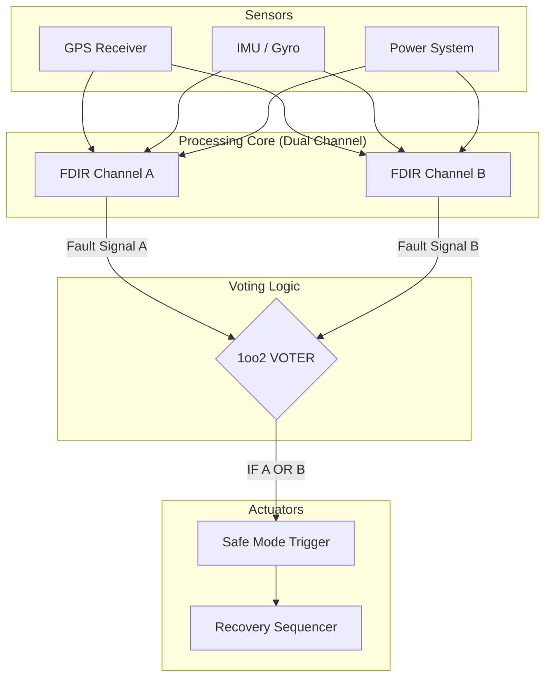

# System Architecture: 1oo2 Redundancy

**System:** MetaSpace.bio FDIR
**Configuration:** 1oo2 (One-out-of-Two) Safety Logic

---

## 1. Architecture Overview

The MetaSpace.bio system utilizes a **1oo2 (One-out-of-Two)** architecture to maximize safety and fault detection probability. In this configuration, two independent FDIR channels operate in parallel. If **either** channel detects a violation of the physical invariants (Bio-Codes), the system triggers the fail-safe recovery mode ("Safe Mode").

This architecture is chosen to prioritize **Safety** (SIL 3) over Availability, ensuring that no dangerous fault goes undetected (minimizing Missed Detection Rate).

---

## 2. Block Diagram

---

## 3. Operational Logic

### 1oo2 Voting Rule
The voter implements a logical **OR** function for fault declaration:
- **Condition:** `Fault_Triggered = (Channel_A_Status == FAULT) OR (Channel_B_Status == FAULT)`

### Channel Independence
- **Channel A:** Primary MetaSpace.bio Instance (running on Main OBC Core 0).
- **Channel B:** Secondary MetaSpace.bio Instance (running on Redundant OBC Core 1 or FPGA).
- **Diversity:** To reduce Common Cause Failures (CCF), Channel B may use compiled code optimized differently or run with a slight timing offset.

---

## 4. Failure Modes and Effects

| Event | Description | System Response | Safety Impact |
|-------|-------------|-----------------|---------------|
| **Channel A Failure** | Channel A stops functioning or crashes. | Channel B continues monitoring. System remains safe (1oo1 fallback). | Minimal (Redundancy lost) |
| **Channel A False Alarm** | Channel A detects fault when none exists. | Voter triggers Safe Mode (False Positive). | Availability reduced, Safety maintained. |
| **Real Fault (e.g. GPS Spoofing)** | Both channels detect violation. | Safe Mode Triggered. | **SAFE** (Hazard mitigated). |
| **Channel A Missed Detection** | Channel A fails to see fault. Channel B detects it. | Safe Mode Triggered. | **SAFE** (1oo2 benefit). |
| **Common Cause Failure** | Both channels fail simultaneously (e.g. EMP, Power loss). | Watchdog Timer (Hardware) resets system. | Critical (Mitigated by Watchdog). |

---

## 5. Conclusion

The 1oo2 architecture ensures that the system meets the **Diagnostic Coverage (DC) requirement of >99%** by allowing either of the two independent monitors to arrest a dangerous situation. This aligns with the SIL 3 PFD calculations documented in `SIL3_PFD_Calculation.md`.
